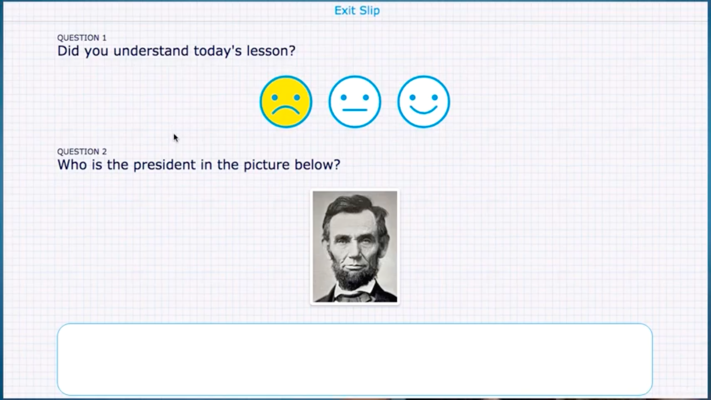

# [Use exit tickets in your lessons - Everything you need to know](https://www.youtube.com/watch?v=QazlHr90O-8)
A good ticket:
- is short;
- are not tests and shouldn't be graded;
- Provides feedback to the teacher.

There are three kinds of questions in a exit ticket:
- Questions that prompt student learning;
- Questions that emphasis the process of learning;
- Questions to evaluate the effectiveness of instruction.

Example from the software the video author makes:

Reasons to use exit slips/tickets:
- To verify that students can solve a problem;
- To emphasis the essential part of a lesson;
- For gathering questions that students have about the topic;
- To see if students have a sufficient level of understanding to apply the content in a new way.

Starter exit ticket prompts:
1. Write down three things you learned today.
2. If you had to explain today's lesson to a friend, what would you tell him/her/them?
3. What question do you have about what we learned today?