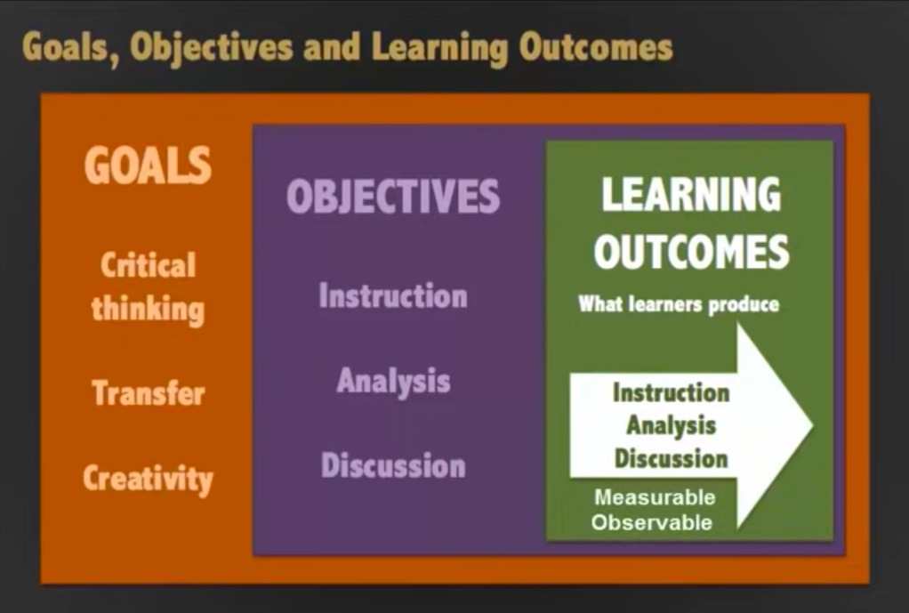
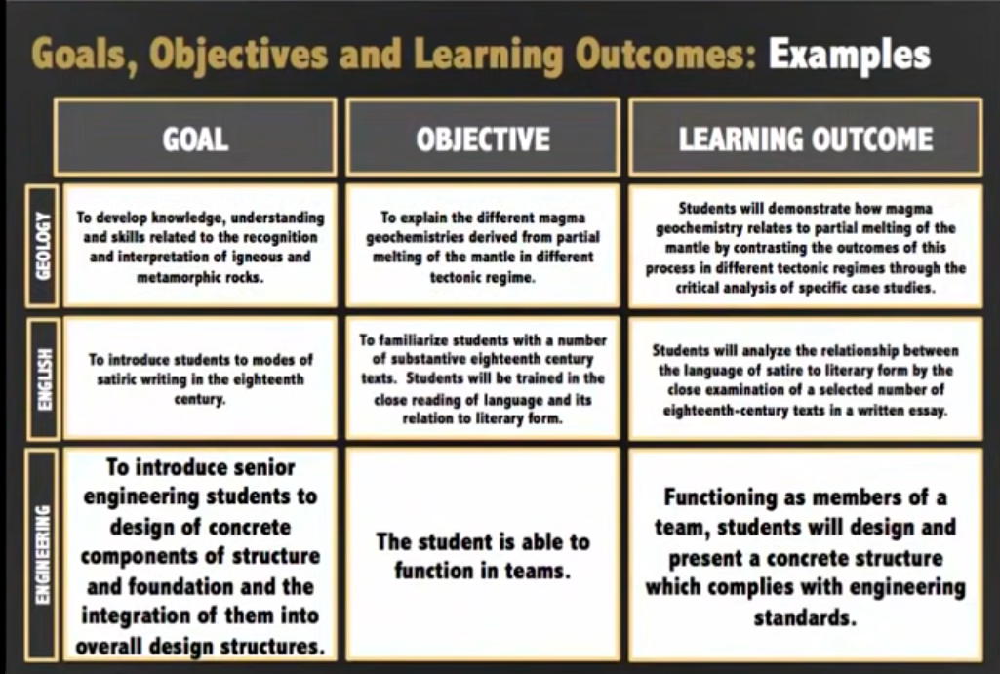
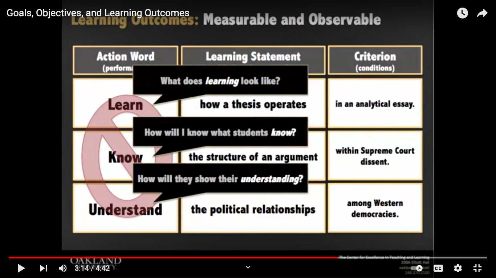
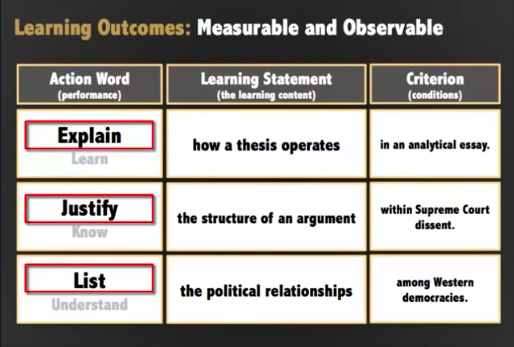
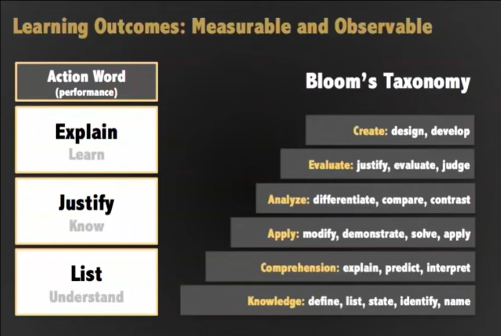

# [Goals, Objectives, and Learning Outcomes](https://www.youtube.com/watch?v=g_Xm5IljYKQ)
by Center for Excellence in Teaching and Learning at OU

- Seems like a traditional behavourism-based summary of how to build a sylabus

- **Goals**: Larger aims of the course.
- **Objectives**: A map of the actions the instructor takes to achieve the Goals.
- **Outcomes**: What the learners actually produce as a result of the instruction Objectives.
    - Used to assess the student's learning so Outcomes must be measurable and observable.

- Goals, Objectives and Outcomes become progressively more concrete.

- Wording matters
- Outcomes should describe the students will be able to do using:
    - Action verbs
    - the Content involved
    - the Context in which they will be using the Content
- These translate to the following in a learning outcome
    1. Action Word (performance)
    2. Learning Statement (the learning content)
    3. Criterion (condition)
- Bad action verbs: Learn, Know, Understand

- Visualizing the action words should lead you to the action verbs that will produce a measurable, observable learning outcome.

- Bloom's Hierarchy of learning organizes action verbs by the level of learning (beginner -> expert)